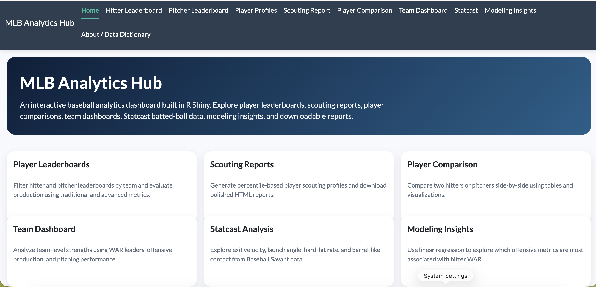
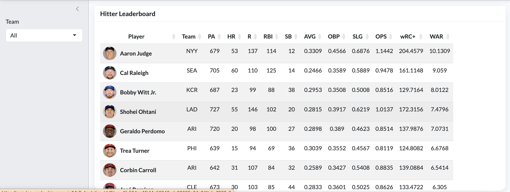
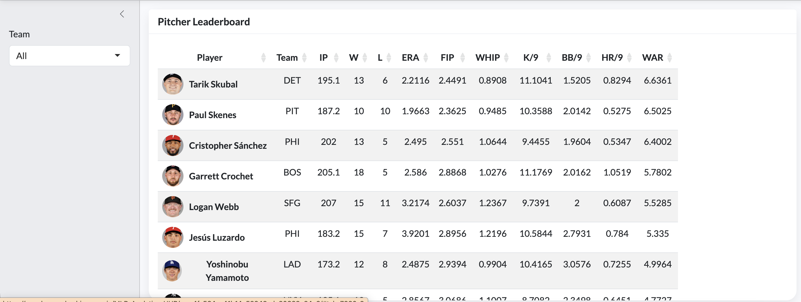
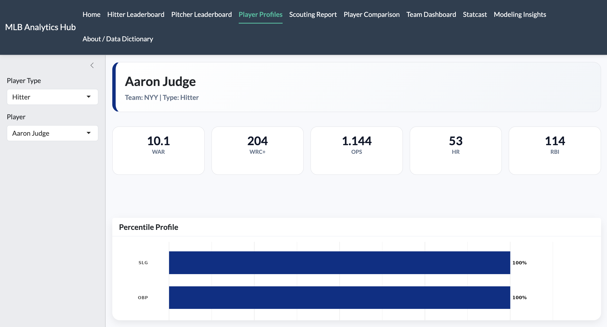
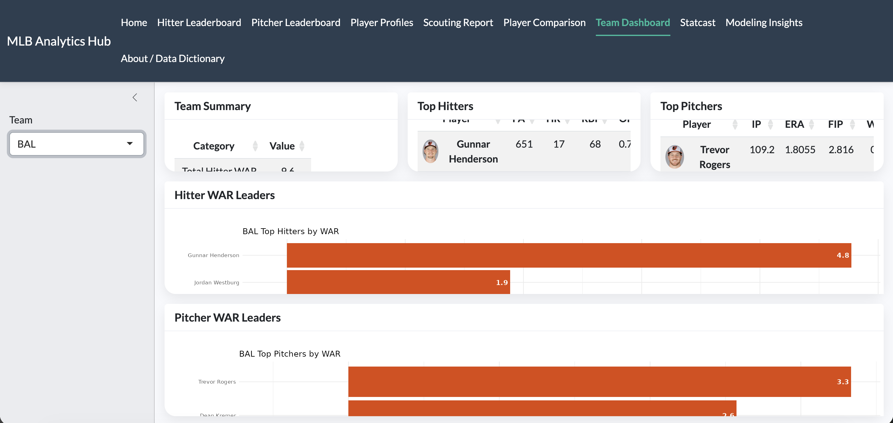
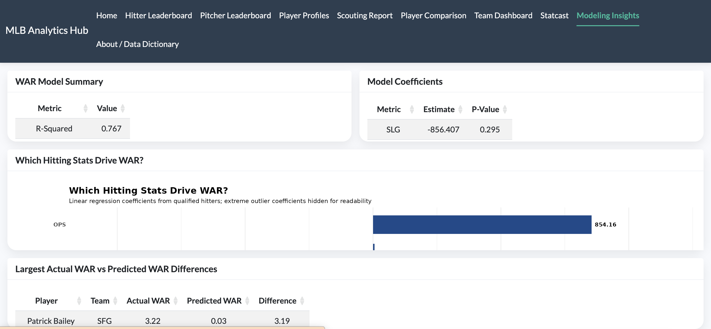

# MLB Analytics Hub

An interactive **Baseball Analytics Dashboard** built with **R Shiny** that allows users to explore player performance, advanced metrics, and scouting insights across Major League Baseball.

**Live App:** https://camden-wade.shinyapps.io/MLB-Analytics-HUB/

---

## Overview

The MLB Analytics Hub is a full-featured analytics platform designed to:

- Analyze hitter and pitcher performance  
- Explore Statcast data and batted ball profiles  
- Generate automated scouting reports  
- Understand what drives WAR using modeling techniques  
- Compare players and evaluate team-level performance  

This project showcases **data engineering, statistical modeling, and interactive visualization** in a production-ready Shiny application.

---

## Features

### Player Profiles
- Key metrics (WAR, wRC+, OPS, etc.)
- Percentile-based performance visualization
- Clean UI with team-based styling

### Scouting Reports
- Automatically generated player scouting reports
- Downloadable reports via Quarto
- Percentile breakdown across core metrics

### Statcast Dashboard
- Exit velocity leaders
- Barrel-like contact rate analysis
- Launch angle vs exit velocity visualization

### Team Dashboard
- Team-level WAR summaries
- Top hitters and pitchers
- Team leaderboards

### Modeling Insights
- Linear regression model explaining WAR
- Feature importance visualization
- Actual vs predicted WAR comparison

### Player Comparison
- Side-by-side player evaluation
- Metric comparisons across key stats

---

## Tech Stack

- **R**
- **Shiny**
- **ggplot2**
- **dplyr / tidyr**
- **plotly**
- **gt**
- **Quarto**

---

## Screenshots

### Home Dashboard


### Batting Leaderboard


### Pitcher Leaderboard


### Player Profile


### Team Dashboard


### Modeling Insights


---

## How to Run Locally

### 1. Clone the Repository

```bash
git clone https://github.com/CamdenWade/MLB-Analytics-HUB.git
cd MLB-Analytics-HUB
```

### 2. Install Required Packages

```R
install.packages(c(
  "shiny",
  "tidyverse",
  "ggplot2",
  "plotly",
  "gt",
  "quarto",
  "DT"
))
```
### 3. Run the Shiny App

```R
shiny::runApp()
```


